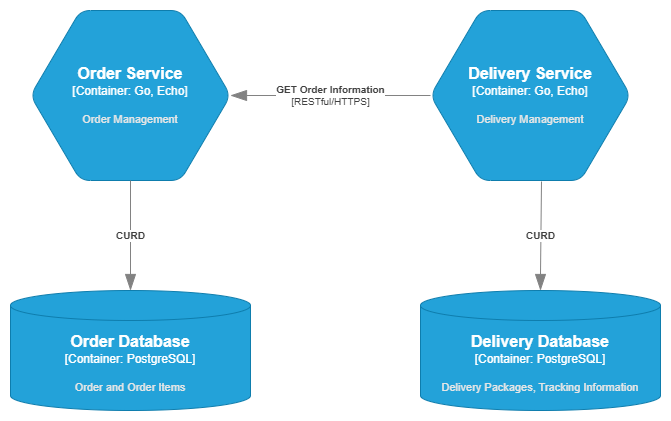
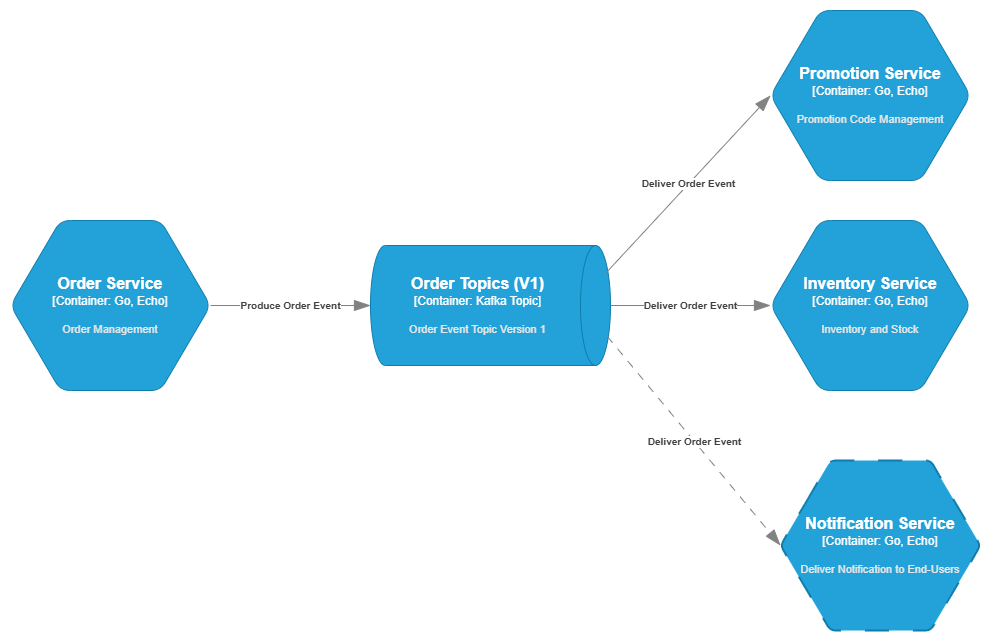
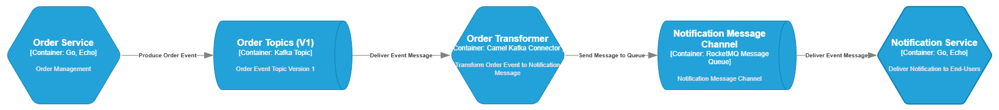
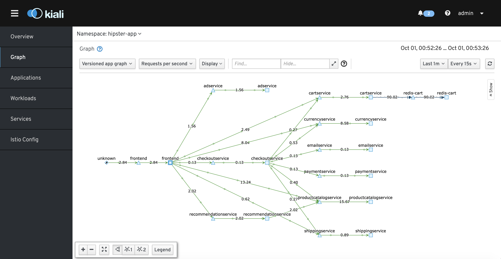

# Designing and Managing Service Dependencies in Microservices

When working on Microservices System, we don't work with only single application, we work with a system that composed of multiple services (application), that each single service will have their own responsibility and have relationship with others that will make the service dependencies.
If with Object Oriented Programming, we have the strategy of `loose coupling, high cohesion` when designing classes relationship, we have the same with Microservices when designing Services with  consideration of what is the responsibility of the service, how is it constructed and how will the service communicate with others.

When working with a microservices system, we are no longer dealing with a single application, but with a distributed system composed of multiple services. Each service is responsible for a specific business function and must interact with others, forming a web of service dependencies. Just as object-oriented design promotes `loose coupling and high cohesion` between classes, the same principles apply to microservices. Designing effective services requires careful consideration of each service’s responsibility, how it is structured, and how it communicates with others.

##  Designing Cohesive and Loosely Coupled Services

Effective microservice architecture begins with thoughtful service design. A well-designed service must encapsulate a clear and focused responsibility, aligning with business domains and promoting high cohesion. At the same time, to enable scalability and maintainability, services must be loosely coupled — interacting through well-defined, minimal interfaces that reduce interdependencies.

This section explores two key aspects of service design:

- **Defining High-Cohesion Services:** How to structure services based on business context, domain boundaries, and the Single Responsibility Principle (SRP) from the SOLID design framework.

- **Achieving Loose Coupling in Communication:** How to design interactions between services to minimize dependencies, using patterns such as REST, gRPC, asynchronous messaging, and service mesh technologies.


### Defining High-Cohesion Services

When designing a microservice, one of the most important principles to follow is the **Single Responsibility Principle (SRP)** — the idea that each service should be responsible for a single, clearly defined task or business capability. In microservices architecture, this responsibility must be rooted in the **domain model** and the **business context** the service is intended to fulfill. A well-defined service should be simple, focused, and cohesive in purpose.

For core domain services, such as an Order Service in an e-commerce system, it is essential to maintain strict boundaries and data ownership. This can be achieved by applying the [**Database per Service pattern**](https://microservices.io/patterns/data/database-per-service.html). Under this pattern, each service is given exclusive access to its own database, ensuring that data is not shared directly between services. This approach enforces encapsulation and helps prevent data duplication and unintended side effects across services.

Take the **Order Service** as an example: it is responsible for managing the **Order domain**, which includes handling order records and order items. This service owns a dedicated **Order database**, which includes tables like `Orders` and `OrderItems`. When another service — such as the **Delivery Service** — needs information about an order (e.g., to initiate shipping), it does not access the Order database directly. Instead, it communicates with the Order Service through well-defined **RESTful APIs**.



By enforcing this boundary, all CRUD operations on orders remain the sole responsibility of the Order Service. This guarantees **data integrity**, **service autonomy**, and ensures that no unexpected changes occur outside the knowledge of the owning service. In turn, this promotes a **high-cohesion** design that is easier to maintain, scale, and evolve independently.

### Achieving Loose Coupling in Communication

In a microservices architecture, how services communicate with each other plays a crucial role in determining the system’s flexibility, scalability, and maintainability. To achieve **loose coupling**, service interactions must be carefully designed to minimize direct dependencies, allowing each service to evolve independently without breaking others. This aligns closely with SOLID principles such as the **Dependency Inversion Principle**, **Interface Segregation Principle**, and **Open/Closed Principle**.

This section explores two main communication approaches and how they support the goal of loose coupling:

- **Synchronous Communication Approaches:**
Using RESTful APIs or gRPC with interface contracts (e.g., OpenAPI or Protobuf) to minimize dependencies and support controlled, versioned interactions.tolerance.

- **Asynchronous Communication Approaches:**
Applying event-driven architecture to decouple producers and consumers, making it easier to extend the system without impacting existing services.

#### Synchronous Communication Approaches

In microservices, synchronous communication is commonly implemented using **RESTful APIs** or **gRPC**, where services interact in a request-response style over the network. To achieve loose coupling, services must define and adhere to clear interface contracts while avoiding direct, hardcoded calls between each other.

To follow the **Dependency Inversion Principle** (SOLID), interface definitions should be decoupled from implementation. This is achieved by using specification tools such as **OpenAPI 3.x** (for REST) or **Protocol Buffers** (for gRPC). These serve as contracts that client services depend on, rather than on internal implementation details.

The **Interface Segregation Principle** is also essential in this context — each service should expose only domain-relevant endpoints and keep its interface concise and focused. For example, an **Order Service** might expose an API like the following:

```yaml
# OpenAPI 3.0 snippet with versioned base URL
openapi: 3.0.3
info:
  title: Order Service API
  version: 1.0.0
servers:
  - url: /v1
paths:
  /orders:
    get:
      summary: Get list of orders
      responses:
        '200':
          description: OK
  /orders/{order-id}:
    get:
      summary: Get order by ID
      parameters:
        - in: path
          name: order-id
          required: true
          schema:
            type: string
      responses:
        '200':
          description: OK
```
Rather than hardcoding service addresses or directly calling other services, communication should go through a **Sidecar proxy**, as implemented in **Service Mesh** frameworks like **Istio**. This allows for advanced features such as:
- Version-based routing (e.g., `/v1` to `Order Service v1`, `/v2` to `Order Service v2`)
- Rate limiting
- Retries and timeouts
- Circuit breakers

Routing can be configured using an `Istio VirtualService`, where the path prefix (like `/v1`) is matched and routed to the appropriate service version:

```yaml
apiVersion: networking.istio.io/v1beta1
kind: VirtualService
metadata:
  name: order-service
spec:
  hosts:
    - order-service
  http:
    - match:
        - uri:
            prefix: /v1
      route:
        - destination:
            host: order-service
            subset: v1
    - match:
        - uri:
            prefix: /v2
      route:
        - destination:
            host: order-service
            subset: v2
```

With this design, different versions of the same service can be deployed and managed independently. Clients access the appropriate version by specifying the URL prefix (e.g., `/v1/orders`), while backend routing and traffic control are handled by the service mesh, not the services themselves.

This architecture keeps services loosely coupled, easy to evolve, and resilient, even under changes or failures in individual components.

#### Asynchronous Communication Approaches

Asynchronous communication is a key enabler of loose coupling in microservices architecture. It allows services to communicate without waiting for immediate responses, which improves resilience, scalability, and independence between components.

##### **Point-to-Point Messaging Pattern:**
A common asynchronous approach is the point-to-point messaging pattern, where Service A sends messages directly to Service B through a dedicated queue. While this approach decouples services at runtime, it introduces tight coupling at the integration level — both services must share an agreed-upon message schema and communication channel. Any schema change in the producer can directly affect the consumer, making the system harder to evolve.

##### **Event-Driven Architecture with Pub/Sub Pattern:**
To further reduce coupling and increase flexibility, it's preferable to adopt an **event-driven architecture** using the publish-subscribe (pub/sub) pattern. In this model:

- A **producer** emits events to a **topic**.
- One or more **consumers** independently subscribe to the topic to react to events.
- The producer is **unaware** of how many consumers exist or what they do — aligning with the **Open/Closed Principle**, as the system can be extended (by adding new consumers) without modifying the producer.

**Example:**<br>
When an order is placed, the Order Service emits an `ORDER_CREATED` event to the topic `/orders/v1`. At this stage, before the payment is processed, the system needs to:
- Validate and apply the **promotion code**.
- Reserve product **stock in inventory**.

To handle these tasks, both the **Promotion Service** and the **Inventory Service** subscribe to the `/orders/v1` topic and consume the event independently to execute their responsibilities.



Importantly, the **Order Service is unaware** of which services consume the event — and doesn't need to be. Later, a **Notification Service** might be added to the system to send confirmation messages to end users. It can simply subscribe to the same topic without requiring any change to the Order Service or to the services already consuming it.

This model keeps services **open to extension** and promotes flexibility, scalability, and independence — a cornerstone of resilient microservice design.

Each new event schema should be published to a **dedicated topic** to avoid tight coupling between event versions. This allows consumers to subscribe only to the topics they understand, ensuring compatibility and isolation.

##### **Event Transformation and Consumer-Specific Queues:**
To further decouple producers and consumers, it's beneficial to introduce an **event transformation layer**:

- Events from a topic are transformed into **consumer-friendly messages**.
- These transformed messages are pushed into **consumer-specific queues**.
- Each consumer reads from its own queue, leveraging features such as **retry**, **FIFO ordering**, and **dead-letter queues** as needed.



This architecture separates event schema (producer-owned) from message schema (consumer-owned), reducing dependencies and enabling each service to evolve independently.

## Service Dependency Management

As microservices systems grow in scale and complexity, managing and understanding the relationships between services becomes increasingly challenging. In particular, for business workflows that span multiple services, **tracing the end-to-end execution path** — especially when failures or latency occur — is critical for operational awareness and debugging.

### Traceability Across Services
To address this, **traceability** plays a key role. Distributed tracing tools (e.g., OpenTelemetry, Jaeger, Zipkin) allow engineers to follow a business request across multiple services and identify where bottlenecks or failures occur. This level of observability is essential for maintaining service-level objectives (SLOs), debugging production incidents, and understanding how services interact during real-world workflows.

### Service Mesh for Dependency Awareness and Control

A **Service Mesh** architecture enhances dependency management by introducing a dedicated control plane that manages service communication at the network level, outside the application code. This includes:

- **Centralized routing**: Directing traffic to specific service versions, handling request retries, timeouts, and failovers.

- **Rate limiting and circuit breaker patterns**: Protecting services from overload and failure cascades.

- **Versioning and traffic shaping**: Enabling progressive delivery strategies like blue-green deployments or canary releases.

### Visualizing Service Dependencies

Service Meshes (e.g., Istio, Linkerd) often integrate with observability tools to automatically generate **real-time visualizations** of service-to-service dependencies. These dependency graphs are built from communication traces, giving technical teams a clear view of which services interact, how often, and under what conditions. This visibility is essential for architecture reviews, performance optimization, and incident response.



### Integration with Observability Platforms

Modern service meshes support integration with external observability systems such as Prometheus, Grafana, Datadog, or New Relic. This allows the collection and visualization of metrics, logs, and traces — offering a unified view of **system health**, **performance**, and **dependencies**.

## Conclusion

Designing and maintaining a microservices system requires more than just splitting features into smaller services — it demands thoughtful planning around service responsibility, communication, and runtime dependency management. By applying proven design principles such as **Single Responsibility**, **Loose Coupling**, and the **SOLID framework**, teams can build systems that are modular, scalable, and easier to evolve.

We began by exploring how to define high-cohesion services based on domain boundaries and business context. We then examined both **synchronous** and **asynchronous** communication patterns — using REST/gRPC and event-driven architectures respectively — to minimize inter-service dependency while maintaining business agility. Finally, we looked at **Service Mesh** as a powerful architectural layer for controlling, observing, and visualizing service dependencies at runtime.

In practice, these strategies allow microservices to operate independently yet collaboratively, ensuring that the system as a whole remains **resilient**, **observable**, and **extensible** as business needs evolve.
